# `gem_mac` — a 1 Gbps Ethernet MAC in Verilog, built from the spec up

A full-duplex 1000BASE-T Media Access Controller written in synthesizable
Verilog-2001 for a $150 Artix-7 board, talking RGMII to the PHY on one side and an
8-bit AXI-Stream interface to user logic on the other.

The MAC is the block an HFT feed handler or order gateway sits directly on top of:
the first logic an inbound market-data frame meets and the last an outbound order
leaves through. This repository builds one — spec, golden model, verification
apparatus, RTL, constraints, and hardware bring-up — following the stage-by-stage
flow in [`fpga_project_flow.md`](fpga_project_flow.md).

**The project is deliberately documented in more depth than it is implemented.**
Every number below traces to a formula or an IEEE clause, and every claim about
what works traces to a test that has been observed both to pass and to fail.

---

## Status

| Stage | State |
|---|---|
| 1 — Specification and architecture | **complete** — [`spec/PROJECT_SPEC.md`](spec/PROJECT_SPEC.md) v0.6 |
| 2 — Build infrastructure | **complete** — skeleton top, constraints, non-project build, `make` targets |
| 3 — Golden model and verification | **complete** — [`verification_plan.md`](verification_plan.md) v1.0 |
| 4 — RTL design | **not started** — this is the next stage |
| 5–8 — Integration, timing closure, bring-up | blocked on Stage 4 and on hardware |

**There is no MAC yet.** `rtl/` currently holds the frozen port list
([`gem_mac_stub.v`](rtl/gem_mac_stub.v), outputs tied to constants) and the Stage 2
blinky top. The testbenches run against that stub and *fail*, which is the intended
Stage 3 result: the verification layer is proven to reject a design that does
nothing before it is trusted to accept one that does something. The only green runs
today are the two harness self-tests, which contain no DUT.

The board (ALINX AX7035B) is not in hand, so every hardware step in B.5 is deferred.

---

## The arithmetic that decides the architecture

```
Line rate:        1 Gbps = 125 MB/s
Datapath:         8 bits @ 125 MHz = 1 byte/cycle = exactly 1 Gbps
Cycles per byte:  125 MHz ÷ 125 MB/s = 1.0
```

**Cycles-per-item is exactly 1**, and almost every structural decision in the design
falls out of that one number:

- **There is no spare cycle during a frame.** A state machine that needs "one extra
  cycle to think" between payload bytes drops data. Everything on the through-path is
  single-cycle-per-byte, precomputed or pipelined.
- **A bit-serial CRC-32 cannot keep up** (8 cycles per byte against a budget of 1), so
  the CRC is byte-parallel. That is arithmetic, not taste.
- **The breathing room is between frames only:** preamble (8) + IFG (12) = 20
  byte-times. Anything needing longer than 20 cycles must be pipelined into the
  stream, not appended after it.
- **Worst-case frame rate is 1.488 Mframe/s** — the rate every per-frame mechanism
  (counters, verdict delivery, FIFO pointers) must sustain.
- **Where this architecture stops working:** at 10 GbE the byte-per-cycle structure
  breaks — XGMII means a 64-bit datapath at 156.25 MHz, and the CRC must be re-widened
  to 64 bits per cycle. The scaling envelope ends at 1G/RGMII.

Buffer depths, the `GTX_CLK` phase shift, and the latency budget are derived the same
way rather than chosen; the derivations are tabulated in
[`PROJECT_SPEC.md` §B.3a](spec/PROJECT_SPEC.md) and re-runnable via
[`spec/budget.m`](spec/budget.m), which reads its constants live from
[`rtl/gem_mac_params.vh`](rtl/gem_mac_params.vh) so the spec and the RTL cannot
silently disagree.

---

## Architecture

Nine modules across three clock domains. Full version with the reset scheme:
[`spec/block_diagram.md`](spec/block_diagram.md); rationale in §B.1a / §B.1b.

```mermaid
flowchart LR
    subgraph TXCLK["tx_clk domain (= sys_clk, 125 MHz from MMCM)"]
        TXIN["AXI-S ingress reg<br/>tuser: DA/SA/EtherType @ SOF"]
        ASM["Frame assembler / padder<br/>preamble+SFD, pad &lt; 46B,<br/>reject &gt; 1500B"]
        CRCTX["Parallel CRC-32 gen<br/>(byte-parallel)"]
        ARB["TX arbiter / IFG counter<br/>96-bit IFG, abort on underrun"]
        REG["Register / status block"]
        MDIO["MDIO master"]
        TXIN --> ASM --> CRCTX --> ARB
    end

    subgraph GTXCLK["gtx_clk_shifted (I/O only, ~1.6 ns from tx_clk)"]
        ODDR_TX["ODDR: TXD[3:0], TX_CTL,<br/>GTX_CLK pin"]
    end

    subgraph RXCLK["rx_clk domain (recovered by PHY, async to tx_clk)"]
        IDDR_RX["IDDR: RXD[3:0], RX_CTL"]
        SFD["SFD hunter / deframer"]
        CRCRX["Parallel CRC-32 checker<br/>+ classifier"]
        IDDR_RX --> SFD --> CRCRX
    end

    FIFO["Async FIFO, rx_clk → sys_clk<br/>depth 64, derived"]
    PHY["KSZ9031RNX PHY<br/>(RGMII)"]

    ARB --> ODDR_TX --> PHY
    PHY --> IDDR_RX
    CRCRX --> FIFO --> RXOUT["AXI-S egress reg<br/>verdict on tuser @ tlast"]
    MDIO <-->|MDC/MDIO| PHY
    REG -.status/counters.-> UARTVIO["UART / VIO"]
```



The four decisions that shape everything else, each with its rejected alternative
recorded in §B.7:

- **Cut-through on RX**, verdict trailing on `tuser` at `tlast` — first byte out as
  soon as it arrives, not after the whole frame. Cost: bad-frame rollback moves to
  user logic. ([`Documents/Bad bitstream handle.md`](Documents/Bad%20bitstream%20handle.md))
- **Cut-through on TX, aborting on underrun** — `TX_ER` plus a bitwise-inverted FCS,
  counted, never resumed. Store-and-forward would make underrun structurally
  impossible at the cost of 12.14 µs of transmit latency, which contradicts the
  premise of the design. (§B.4b)
- **RGMII skew:** PHY-side default 1.2 ns on RX (no MDIO write needed); FPGA-side
  MMCM phase shift of ≈1.6 ns on TX — the *centre* of the KSZ9031RNX's 1.2–2.0 ns
  window, giving ±0.4 ns margin, not the 2.0 ns edge that a naive 90° shift lands on
  with zero margin. (§B.1b)
- **`sys_clk` = `tx_clk` for v1**, which collapses the CDC surface to the one
  crossing that is unavoidable (`rx_clk` → user). (§B.7 item 3)

---

## Verification

The golden model is MATLAB ([`model/+gem/`](model/+gem)) — frame builder, CRC-32,
RGMII encode/decode, deframer, and a seeded parametric stimulus generator. It is
validated against the published CRC-32 check value, against Python's `zlib` over
2000 random vectors, against the CRC residue property, and by a full
build → RGMII → deframe → parse round trip across the length sweep.

Sixteen frozen directed scenarios are committed under
[`model/vectors/`](model/vectors) — eleven RX, five TX — each one cross-checked by
reading its own wire back through the golden RX path, so generator intent and model
opinion are independent sources that have to agree. The large random sweeps are not
committed: they regenerate bit-identically from the seed in their manifest.

```bash
make check
```

runs the four gates in the order that makes a failure diagnosable — model tests,
committed-vector staleness, Verilator lint (R22), then the scenario regression.
**Each gate has been observed to fail**, not merely to pass: an injected width
mismatch trips lint, one corrupted octet trips the vector gate, a planted assertion
trips the regression, and the stub trips everything downstream.

| Command | What it does |
|---|---|
| `make model` | the golden model's own test suite |
| `make vectors` | regenerate every scenario from its seed |
| `make vectors-check` | do the committed vectors still match the model? |
| `make lint` | Verilator `--lint-only -Wall` on every design top |
| `make sim S=rx_min_gap` | one scenario |
| `make regress` | every frozen scenario — the gate |
| `make regress-all` | plus the large random sweeps |
| `make synth impl bitstream program` | Stage 2 build flow |

Every requirement R1–R24 maps to a named test with a current status in
[`verification_plan.md`](verification_plan.md). A requirement with no test name is
not a requirement that is passing — it is one nobody is checking.

> **On Windows** `make` is not on PATH, but Vivado bundles it at
> `<Vivado>/gnuwin/bin/make.exe`. Or skip make entirely: every target is a thin
> wrapper over `python scripts/run_sim.py`, `python scripts/lint.py`, and
> `matlab -batch "addpath('model'); runModelTests();"`. The scripts locate Vivado,
> Verilator and MATLAB themselves, so none of them needs to be on PATH.

---

## Repository layout

```
spec/               PROJECT_SPEC.md (requirements R1–R24, derivations), block diagram, budget.m
model/              MATLAB golden model, stimulus generator, its tests, committed vectors
rtl/                gem_mac_params.vh (single source of truth for sized constants),
                    gem_mac_stub.v (frozen port list), skeleton_top.v (Stage 2 blinky)
tb/                 SystemVerilog testbenches, RGMII BFM, AXI-S driver, bound assertions
constrs/            clocks.xdc / pins.xdc / exceptions.xdc
scripts/            build.tcl, program.tcl, run_sim.py, check_vectors.py, lint.py, clean.py
Documents/          derivations too long to inline in the spec
reference/          verilog-ethernet submodule — read-only reference, nothing links against it
fpga_project_flow.md   the stage-by-stage method this project follows
verification_plan.md   test ↔ requirement ↔ status traceability
```

```bash
git clone --recurse-submodules https://github.com/sraghup7/MAC-1G.git
```

---

## Target hardware

| | |
|---|---|
| Board | ALINX AX7035B (~$150) |
| FPGA | AMD Artix-7 XC7A35T-2FGG484I |
| PHY | Microchip KSZ9031RNX, RGMII, **wired to fabric I/O** |
| Toolchain | Vivado free tier — no paid IP; the AMD Tri-Mode Ethernet MAC is never touched |

The fabric-attached PHY is the whole board-selection criterion, and it eliminates most
budget boards: the Arty family's PHY is 10/100 only, and Zynq boards (PYNQ-Z2, Zybo,
KV260) wire their gigabit PHY to the PS hard MAC via MIO — you would be configuring
someone else's MAC, not building one. §A.1 has the full elimination list.

Utilisation budget is <10% of the 35T. The scarce resource is the MMCM (1 of 5), not
LUTs.

---

## Non-goals for v1

10/100 fallback · jumbo frames · 802.3x flow control · VLAN awareness · anything at
layer 3+ (ARP/IP/UDP — the natural v2) · half duplex and CSMA/CD · store-and-forward
buffering.

Known weaknesses are stated up front rather than discovered later — the board
oscillator's ppm rating is the standard's ±100 ppm ceiling and not yet confirmed
against the AX7035B BOM; the RGMII timing numbers come from the datasheet and are not
yet cross-checked against the physical board; and the LUT/FF/BRAM line items are
inherited per-block estimates whose derivation is not traceable, unlike the FIFO
depth, clock phase and latency numbers. See §B.7.
