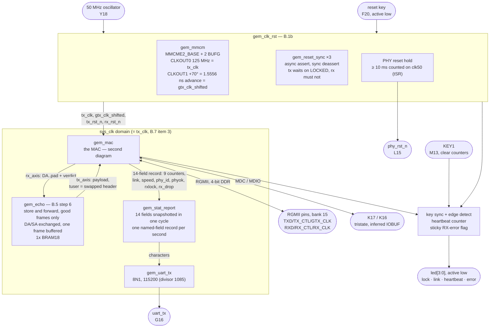

# `gem_mac` — Block Diagrams

Companion to [`PROJECT_SPEC.md`](PROJECT_SPEC.md) B.1a. **Two pictures, because
they answer different questions.** The first is the board Stage 5 built — what is
instantiated, what reaches a pin, and what feeds what. The second is the MAC's
insides, which is where the datapath decisions live. One diagram doing both would
be unreadable, and until Stage 5 the second was the only one here, which made a
drawing of a component read as a drawing of the system.

---

## The board (`gem_top`)

Everything below `gem_top` is portable Verilog that knows nothing about an ALINX
AX7035B; everything specific to one PCB is in that file or in `constrs/`.

**What drives the transmit port.** A bare board has no user logic, so without
`gem_echo` the MAC's transmit side would never be exercised on hardware at all.
Echo is store-and-forward — the opposite of the MAC's own cut-through decision
(B.4b), for the opposite reason: a frame's verdict arrives with its last octet, so
an echo that streamed could not know whether the frame deserved echoing.

**Pins.** Every pin above is confirmed against the board schematic; the provenance
is in `Manuals/AX7035B_pinout_notes.md` (kept locally, git-ignored -- vendor
material) and the argument is V-21.

---

## Inside the MAC (`gem_mac`)

Three clock domains: `tx_clk` (125 MHz, also `sys_clk` for v1), `gtx_clk_shifted`
(125 MHz, phase-shifted copy of `tx_clk`, I/O-only), and `rx_clk` (125 MHz,
recovered by the PHY, deskewed by the second MMCM, asynchronous to the other
two). See B.1b for the clocking/reset rationale (TX phase +70° = 1.5556 ns
advance, re-derived for the JL2121(D) to cancel a measured FPGA-internal
clock-forwarding asymmetry — see
`docs/reports/stage9/rgmii-jl2121-retiming-report.md`) and B.3a for the
derived numbers.

```mermaid
flowchart LR
    subgraph TXCLK["tx_clk domain (= sys_clk)"]
        TXIN["AXI-S ingress reg\n(tdata/tvalid/tready/tlast,\ntuser: DA/SA/EtherType @ SOF)\ndetects mid-frame starve — B.4b"]
        ASM["Frame assembler / padder\n(preamble+SFD, DA/SA/EtherType,\npad < 46B, reject > 1500B)"]
        CRCTX["Parallel CRC-32 gen\n(byte-parallel, B.7 item 2)\nFCS, or inverted FCS on abort"]
        ARB["TX arbiter / IFG counter\n(96-bit IFG, no CSMA/CD)\nowns the abort: TX_ER, drop TX_EN,\ndiscard the rest — B.4b"]
        REG["Register / status block\n(9 counters incl. tx_underrun,\nlink state, sticky flags — R17)"]
        MDIO["MDIO master\n(<= 2.5 MHz MDC — R16)"]
        TXIN --> ASM --> CRCTX --> ARB
    end

    subgraph GTXCLK["gtx_clk_shifted (I/O only, +70° = 1.5556 ns advance from tx_clk)"]
        ODDR_TX["ODDR: TXD[3:0], TX_CTL,\nGTX_CLK pin"]
    end

    subgraph RXCLK["rx_clk domain (deskewed, async to tx_clk)"]
        IDDR_RX["IDDR: RXD[3:0], RX_CTL\n(deskew MMCM capture clock,\n−45° trim — task-4e)"]
        SFD["SFD hunter / deframer\n(strip preamble, stream\nDA..pad onward -- B.4a)"]
        CRCRX["Parallel CRC-32 checker\n+ classifier\n(runt/oversize/bad-FCS/RX_ER)"]
        IDDR_RX --> SFD --> CRCRX
    end

    subgraph CDC["Async FIFO (rx_clk -> sys_clk)\ndepth = 64 (B.3a derivation)"]
        FIFO["cut-through, trailing\ngood/bad verdict on tuser"]
    end

    PHY["JL2121(D) PHY\n(RGMII)"]

    ARB --> ODDR_TX --> PHY
    PHY --> IDDR_RX
    CRCRX --> FIFO --> RXOUT["AXI-S egress reg"] --> ABORT["gem_rx_abort (V-25)\ncloses a frame the link\ntook away: one synthetic beat,\ntlast=1, tuser=0"]

    MDIO <-->|MDC/MDIO| PHY
    REG -.status/counters.-> READOUT["gem_stat_report + gem_uart_tx\n(R17, B.7 item 5 — board diagram)"]
```

**Reset (B.1b):** each domain gets its own async-assert / sync-deassert reset;
`tx_clk`-domain release waits on MMCM lock, and `rx_clk`'s release is gated on
`tx_rst_n & rx_mmcm_locked` — the deskew MMCM sits on a recovered clock that
does not self-recover after a link drop, so a clk50-clocked supervisor re-pulses
its reset until it locks, and `rx_path_rst_n` covers the destination half of every
crossing out of the RX domain. PHY `RST_N` is held low ≥ 10 ms (JL2121(D) DS009 §4.7.1 `t1`/`t3`)
before MDIO is touched.
All of that is `gem_clk_rst`, built in Stage 5 and drawn above; `gem_mac` takes the
four signals as inputs and contains no reset synchroniser of its own.

**That split is tested, not just drawn.** Because the two domains release at
different moments by construction, and `gem_rx_fifo` straddles them with a reset
from each side, `tb_gem_top` asserts the board's reset mid-frame — with a frame
arriving and a frame leaving — and requires the design to come back and count a
replay exactly.
