# `gem_mac` — Block Diagram

Companion to [`PROJECT_SPEC.md`](PROJECT_SPEC.md) B.1a. Three clock domains: `tx_clk`
(125 MHz, also `sys_clk` for v1), `gtx_clk_shifted` (125 MHz, phase-shifted copy of
`tx_clk`, I/O-only), and `rx_clk` (125 MHz, recovered by the PHY, asynchronous to the
other two). See B.1b for the clocking/reset rationale (including why the phase target is
1.6 ns, centered in the PHY's window, not 2.0 ns at its edge) and B.3a for the derived
numbers.

```mermaid
flowchart LR
    subgraph TXCLK["tx_clk domain (= sys_clk)"]
        TXIN["AXI-S ingress reg\n(tdata/tvalid/tready/tlast,\ntuser: DA/SA/EtherType @ SOF)"]
        ASM["Frame assembler / padder\n(preamble+SFD, DA/SA/EtherType,\npad < 46B, reject > 1500B)"]
        CRCTX["Parallel CRC-32 gen\n(byte-parallel, B.7 item 2)"]
        ARB["TX arbiter / IFG counter\n(96-bit IFG, no CSMA/CD)"]
        REG["Register / status block\n(counters, link state,\nsticky flags — R17)"]
        MDIO["MDIO master\n(<= 2.5 MHz MDC — R16)"]
        TXIN --> ASM --> CRCTX --> ARB
    end

    subgraph GTXCLK["gtx_clk_shifted (I/O only, ~1.6ns phase from tx_clk)"]
        ODDR_TX["ODDR: TXD[3:0], TX_CTL,\nGTX_CLK pin"]
    end

    subgraph RXCLK["rx_clk domain (async to tx_clk)"]
        IDDR_RX["IDDR: RXD[3:0], RX_CTL\n(PHY default 1.2ns delay,\nno FPGA IDELAY needed)"]
        SFD["SFD hunter / deframer\n(strip preamble, extract\nDA/SA/EtherType)"]
        CRCRX["Parallel CRC-32 checker\n+ classifier\n(runt/oversize/bad-FCS/RX_ER)"]
        IDDR_RX --> SFD --> CRCRX
    end

    subgraph CDC["Async FIFO (rx_clk -> sys_clk)\ndepth = 64 (B.3a derivation)"]
        FIFO["cut-through, trailing\ngood/bad verdict on tuser"]
    end

    PHY["KSZ9031RNX PHY\n(RGMII)"]

    ARB --> ODDR_TX --> PHY
    PHY --> IDDR_RX
    CRCRX --> FIFO --> RXOUT["AXI-S egress reg"]

    MDIO <-->|MDC/MDIO| PHY
    REG -.status/counters.-> UARTVIO["UART / VIO (R17)"]
```

**Reset (B.1b):** each domain — `tx_clk`, `rx_clk` — gets its own async-assert /
sync-deassert reset; `tx_clk`-domain release additionally waits on MMCM lock. PHY
`RST_N` is held low ≥ 10 ms (KSZ9031RNX `tSR`) before MDIO is touched.
